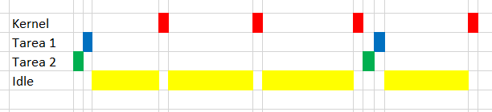
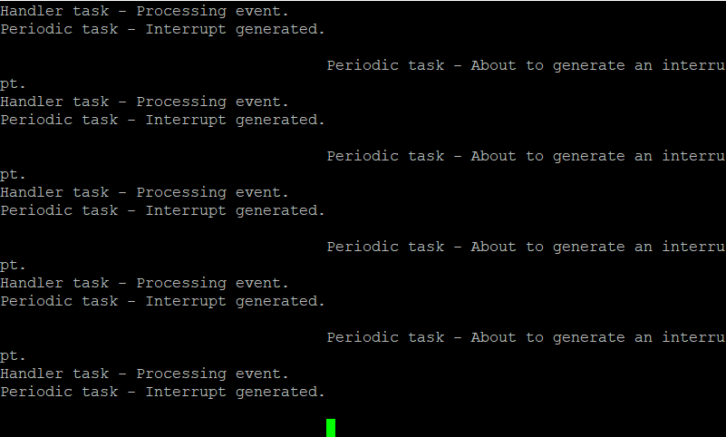

# TP3- Uso de FreeRTOS

## 1- Archivos y tipos de datos

### Archivos

  

### Funciones

| Función               | Archivo                    | Descripción                                                                                       | Hardware              |
|-----------------------|----------------------------|---------------------------------------------------------------------------------------------------|-----------------------|
| prvSetupHardware()    | freertos_examples_1_to_9.c | Inicia los periféricos, incluidos el Clock y el LED                                               | LED = OFF             |
| DEBUGOUT()            | board_api.h                | Imprime por consola el string pasado como paràmetro                                               | UART                  |
| xTaskCreate()         | task.c                     | Crea la tarea segun los paràmetros pasados y la agrega a la listas de tareas listas para correr   |                       |
| vTaskStartScheduler() | task.c                     | Inicia el kernel. A partir de este punto el kernel tiene control a quien le asigna tiempo del CPU |                       |
| Board_LED_Set()       | board.c                    | Setea el estado del LED segun los paràametros pasados                                             | LED = OFF o LED = ON |

### Variables

| Variable             | Tipo                   | Archivo                    | Descripción                                                          |
|----------------------|------------------------|----------------------------|----------------------------------------------------------------------|
| mainDELAY_LOOP_COUNT | MACRO                  | freertos_examples_1_to_9.c | Macro que define el largo de la demora implementada por el ciclo for |
| pcTextForMain        | const char *           | freertos_examples_1_to_9.c | String que guarda el nombre del ejemplo                              |
| vTask                | Prototipo              | freertos_examples_1_to_9.c | Prototipo de la tarea                                                |
| ul                   | volatile unsigned long | freertos_examples_1_to_9.c | Valor utilizado para implementar la demora                           |

## 2- Ejemplos 1 al 9

### Ejemplo 1

A continuacion se observa el diagrama temporal de la distribución del tiempo del CPU:

  

En este ejemplo se crean dos tareas continuas de igual prioridad. Como ambas tienen la misma priorioridad, se ejecutan alternadas indefinidamente, teniendo ambas la misma cantidad de tiempo el CPU. En estas tareas se apaga y enciende un LED y cada una se imprime un mensaje por serial diciendo que tarea se esta ejecutando.
En caso del time slice de 1ms a la salida de la consola se observa el siguiente mensaje:
  
Esto se debe a que durante el envio de un string, debido a la velocidad del puerto serial, no se llega a enviar todo el mensaje en 1mS. Por eso, los mensajes de las tareas de ven cortados y pisado por la otra tarea. Para corregir esto se extiende el time_slice a 100mS y se observa la siguiente salida:
  

### Ejemplo 2

Este ejemplo es similar al anterior:

Sin embargo las función que corre en las tareas es la misma para ambas tareas, con la diferencia de que se pasa un parametro distinto a la hora de crearlas. Ambas tareas se crean con la misma priodidad, como en el ejemplo 1. Ese parametro en este caso es el string que identifica el nombre de la tarea. La tareas cuentas con un delay implementado de manera ineficiente con un ciclo for. Se tiene el mismo problema que en el ejercicio anterior con la salida por consola.

### Ejemplo 3
A continuacion se observa el diagrama temporal de la distribución del tiempo del CPU:

 

Este ejercicio es totalmente igual al ejericicio anterior, con la diferencia del valor de prioridades: la prioridad de la Task2 es 1 unidad mayor q la Task1. Es por esto, que al ser tareas de procesamiento continuo y nunca delegar el uso del CPU, el kernel le otorga 100% del tiempo del CPU a la segunda tarea, sin importar el time_slice. Por eso a la salida de la consola se obtiene el siguiente resultado:

 

### Ejemplo 4

En este ejercicio vTaskDelay(). 

 

Se crean dos tareas que realizan lo mismo que en los ejercicios anteriores. La tarea 2 tiene prioridad superior que la 1. En la función se conmuta un LED, se imprime el mensaje por consola y se ejecuta vTaskDelay(). Esta función coloca en estado BLOCKED a las tareas hasta que transcurre el tiempo pasado a la misma. La tarea corre hasta llegar a esta función y delega el uso del CPU. Cuando pasa el tiempo, la tarea pasa a READY y el kernel llama a la tarea 2, que tiene más prioridad. Cuando esta termina, se ejecuta la tarea 1. Esto se observa en la terminal:

 

### Ejemplo 5

En este ejercicio vTaskDelayUntil().

 

Este ejercicio es similar al anterior, con la diferencia de utilizar vTaskDelayUntil() en vez de vTaskDelay(). A continución se explica la diferencia:
En vTaskDelay se le indica cuanto tiempo despues de llamar a vTaskDelay se quiere que la tarea se depierte (pase a READY). El parametro en vTaskDelay es el periodo de delay en numeros de ticks desde que se llama a la función.
En vTaskDelayUntil  se le indica en que tiempo se quiere despertar la tarea. El parametro en vTaskDelayUntil es el tiempo absoluto en ticks en el que se quiere despertar la tarea, calculado como un incremento del tiempo cuando fue despertado por última vez.

La salida por consola es la siguiente:

 

### Ejemplo 6

En este ejemplo se combina el uso de dos tareas continuas (Tarea 1 y 2) y una periodica (Tarea 3):

 

La tarea periodica tiene más prioridad que las continuas, las cuales tienen misma prioridad entre ellas. La tarea periodica se ejecuta cada 10mS e imprime por consola un mensaje diciendo que esta corriendo. Las continuas imprimen cada un determinado tiempo (delay implementado con for) por consola un string diciendo el nombre de donde viene el mensaje. Lo que sucede es que cada vez que se llama a la tarea 3 se imprime un mensaje, cada 10 mS. En el caso de las continuas, si bien se le asigna tiempo del CPU, teiene una demora cada cuanto se imprime el mensaje. La salida de la consola se ve en la siguiente imagen:

 

Se observa que la impresion del mensaje de la tarea 3 es mucho más frecuente, debido a que el delay implemetado por un ciclo for en las tareas continuas es mayor a 10mS. Tambien se observa que la función.periodica se ejecuta en el medio de una continua, haciendo que el mensaje de la continua se vea interrumpido.

### Ejemplo 7

En este ejemplo se utiliza vApplicationIdleHook(), que permite utilizar funciones en la tarea Idle

 

Se crean dos tareas peridicas (Tarea 1 y Tarea 2). Se ejecutan normalmente segun su prioridad y se bloquean. El tiempo restante hasta cumplir el time_slice, se ejecuta la tara Idle. Para utilizar esta tarea se utliza vApplicationIdleHook. En este ejemplo, en vApplicationIdleHook se incrementa un variable global y se manda a dormir al CPU hasta la siguiente interrupcion (__WFI()). En las tareas periodicas se imprime el valor de esta variable.

El resultado se ve en la consola:

 

### Ejemplo 8

En este ejemplo se hace uso del cambio dinamico de priodidades.

 

En este ejemplo de se crean dos tareas. La Tarea 1 tiene más prioridad e incrementa la prioridad de la Tarea 2 cada vez que se ejecuta. La Tarea 2 baja su misma prioridad cada vez que se le asigna el CPU. Cuando arranca el programa, el kernel asigna el CPU a la Tarea 1, la cual lee su propia prioridad con uxTaskPriorityGet() y asigna a la Tarea 2 esa priorida más uno con vTaskPrioritySet(). En ese momento se genera un cambio de contexto y la tarea de mayor prioridad es ejecutada. Entonces se ejecuta Tarea 2, ya que ahora tiene mayor prioridad que la Tarea 1. Al igual que la Tarea 1, la Tarea 2 lee su prioridad y se baja en dos unidades. De esta manera pasa a ser de menos prioridad que la Tarea 1. En este momento el kernel cambia de contexto y el ciclo comienza de nuevo. Se remarca que un cambio de time_slice no generaria un cambio en el funcionamiento del programa ya que se tiene un cambio continuo de contexto entre dos tareas.

Por cada llamado de las tareas se imprime un string por la consola. El resultado se ve en la siguiente imagen. 

 

### Ejemplo 9

En esta tarea se implenta la creación y destrucción de tareas de manera dinámica con xTaskCreate() y vTaskDelete(). El siguiente diagrama de tiempo no está en escala, en el sentido que la demora de 100mS de la Tarea 1 está representada como 2mS por simplificación.

 

En este ejemplo se crea solo la Tarea 1, la cual cada 100mS crea a la Tarea 2, con más prioridad que la propia e imprime un mensaje por consola. Cuando se ejecuta la Tarea 2, esta no hace más que imprimir un mensaje y destruirse. El resultado por consola es el siguiente:

 

## 3- Ejemplos 10 al 16

### Ejemplo 10

En este ejemplo de se sincronizan dos tareas creadoras con una consumidora a traves de colas:

 

La Tarea Receiver tiene más prioridad que las dos Tareas Sender. Cuando arranca el programa, el CPU es asignado a la Tarea Receiver, la cual queda en estado BLOCKED en la espera de que haya un dato en la cola (xQueueReceive()). Luego corre la Tarea Sender2 y carga en la cola un valor con xQueueSendToBack() y llama a taskYIELD() para deelgar el uso del CPU. En este momento el kernel sabes que deja de estar vacia la cola y asigna el CPU a la Tarea Receiver, la cual imprime el valor por consola y vuelve a esperar un valor, el cual se llena por Tarea Sender 1. 

El resultado por consola es el siguiente:

 

### Ejemplo 11

En este ejemplo se pasan estructuras por las colas para sincronizar las tareas. 

 

Este ejercicio es similar al anterior, sin embargo ahora las Tareas Sender tienen mayor prioridad que la Tares Receiver. Es por eso que se ejecutan alternadamente hasta llenar la cola. En este momento entra en escena el ultimo parametro de xQueueSendToBack(), el cual indica cuanto tiempo tiene que permanecer en BLOCKED la tareas hasta q haya espacio. Cuando ambas Sender quedan en BLOCKED, se ejecuta Receiver, la cual imprime un mensaje y libera en lugar en la cola. En este momento una de las Sender llena este espacio y se repite el ciclo. Ademas, ahora por la cola no se pasa solo el valor, sino una estructura que contiene el valor y un numero indicando el origen (cual de las Tareas Sender agregó el dato).

El resultado por pantalla es el siguiente:

 

### Ejemplo 12

En este ejemplo se sincroniza una interrupción con una tarea gracias a un semaforo binario

 

Para generar una interrupción se llama a una tare periódica que simula eventos del mundo real. Esta tarea (Tarea Periodic) tiene un delay de 500ms y genera una interrupción, cuyo ISR prende el semaforo con la función xSemaphoreGiveFromISR(). Luego hay otra tarea, Tarea Handler, la cual se encuentra en BLOCKED hasta que se prenda el semaforo, momento en el que lo apaga e imprime un mensaje.
El resultado por consola es el siguiente:

 

### Ejemplo 13

En este ejemplo se sincroniza una interrupción con una tarea gracias a un semaforo contador

 

Este ejercicio es similar al anterior, con la diferencia que en la ISR se prenden tres veces el semaforo contador, con xSemaphoreGiveFromISR(). De esta manera, cuando se vuelve de la ISR se puede procesar los tres casos con la Tarea Handler
El resultado por consola es el siguiente:

 

### Ejemplo 14

Este ejemplo es similar al anterior.

 

Se utilizan dos colas, una que guarda string y otra enteros. Al igual que en el ejemplo 13, la Tarea StringPrinter se bloquea hasta recibir algo por la cola de strings. La Tarea IntegerGenerator cada 200mS coloca 5 numeros en la cola y genera una interrupcion. En la ISR de la misma, se procen estos numeros y se envia con xQueueSendToBackFromISR() strings a la cola de strings. Es entonces que se desbloquea la Tarea StringPrinter y se imprimen los mensajes por consola.

EL resultado de la consola es el siguiente:
 
 

### Ejemplo 15

En este ejemplo se utiliza un Mutex para proteger un recurso compartido, en este caso la UART para imprimir por cola

 

Se tiene dos tareas que imprimen por consola un mensaje largo cada un tiempo aleatorio. En caso de no usar una proteccion del recurso, los mensajes por consola se verian partidos por la mitad, pisados. En este ejemplo se utiliza un Mutex, que hace que una tarea no pueda acceder a la UART hasta que la otra tarea lo haya liberado, permitiendo que dos tares puedan acceder de manera ordenada a un recurso unico.
El resultado por consola es el siguiente:

 

### Ejemplo 16

En este ejercicio se tienen tres tareas que producen mensajes y una que se encarga de administrar el recurso de impresion por consola:

 

Las Tareas Print1 y Print2 agregan, cada un tiempo aleatorio, strings a la cola. En este ejemplo se utiliza vApplicationTickHook(), la cual cuenta hasta 200 y agrega un mensaje a la cola con xQueueSendToFrontFromISR(), ya que se ejecuta en en la interrupcion del SysTick. La Tarea Gatekeeper se encuentra bloqueada hasta que la cola de mensajes deja de estar vacia. En este momento imprime el mensaje por consola. Para este ejemplo se tuvo que modificar configUSE_TICK_HOOK a 1 para que funcione como se espera.
El resultado por consola es el siguiente:

 

## Aplicación 1

En la siguiente aplicación se tiene el siguiente diagrama temporal:

 

Se crean tres tareas, de las cuales la Tarea 1 es la periodida. A esta se le asigna a la mayor prioridad, mientras que las otras dos estan al mismo nivel. La Tarea 1 genera un interrupcion cada 500mS. En este interrupcion se da un semaforo binario, el cual desbloquea la Tarea 2. Esta agrega un valor a la cola que desbloquea la Tarea 3, la cual imprime por consola el valor.

El reusltado por consola es el siguiente:

 

## Aplicación 2

En la siguiente aplicación se tiene el siguiente diagrama temporal:

La aplicación es similar a la anterior, con la diferencia fundamental que la Tarea 2 ahora se sincroniza con la ISR mediante una cola y la Tarea 2 se sincroniza con la Tarea 3 mediante un semaforo binario.

El reusltado por consola es el siguiente:

 

## Aplicación 3

En la siguiente aplicación se tiene el siguiente diagrama temporal:

Se crean tres tares con la misma prioridad que quieren utilizar un recurso en comun (LED + UART). Se les asigna la misma prioridad para que las 3 tengan la misma oportunidad de acceder el recurso. Cada tarea desea hacer encender durante 500 mS y apagar durante 500mS al LED e imprimir por consola su estado. Las tres tareas se crean desde el mismo prototipo, pasandoles distintos paràmetros. 

Se protege el recurso utilizando un Mutex que se toma al comenzar la tarea si se puede, se prende el LED, se tiene una demora (vTaskDelay) de 500ms, se apaga el LED, se tiene una demora igual y se suelta el Mutex.

Las tres tareas ciclan el uso del LED como se observa en la consola:

