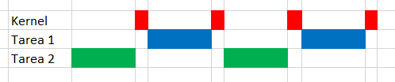

# TP3- Uso de FreeRTOS

## 2- Ejemplos 1 al 9

## Ejemplo 1

A continuacion se observa el diagrama temporal de la distribución del tiempo del CPU:

  

En este ejemplo se crean dos tareas continuas de igual prioridad. Como ambas tienen la misma priorioridad, se ejecutan alternadas indefinidamente, teniendo ambas la misma cantidad de tiempo el CPU. En estas tareas se apaga y enciende un LED y cada una se imprime un mensaje por serial diciendo que tarea se esta ejecutando.
En caso del time slice de 1ms a la salida de la consola se observa el siguiente mensaje:
  
Esto se debe a que durante el envio de un string, debido a la velocidad del puerto serial, no se llega a enviar todo el mensaje en 1mS. Por eso, los mensajes de las tareas de ven cortados y pisado por la otra tarea. Para corregir esto se extiende el time_slice a 100mS y se observa la siguiente salida:
  

## Ejemplo 2

Este ejemplo es similar al anterior:

Sin embargo las funcion que corre en las tareas es la misma para ambas tareas, con la diferencia de que se pasa un parametro distinto a la hora de crearlas. Ambas tareas se crean con la misma priodidad, como en el ejemplo 1. Ese parametro en este caso es el string que identifica el nombre de la tarea. La tareas cuentas con un delay implementado de manera ineficiente con un ciclo for. Se tiene el mismo problema que en el ejercicio anterior con la salida por consola.

## Ejemplo 3
A continuacion se observa el diagrama temporal de la distribución del tiempo del CPU:

 

Este ejercicio es totalmente igual al ejericicio anterior, con la diferencia del valor de prioridades: la prioridad de la Task2 es 1 unidad mayor q la Task1. Es por esto, que al ser tareas de procesamiento continuo y nunca delegar el uso del CPU, el kernel le otorga 100% del tiempo del CPU a la segunda tarea, sin importar el time_slice. Por eso a la salida de la consola se obtiene el siguiente resultado:

 

## Ejemplo 4

En este ejercicio vTaskDelay(). 

 

Se crean dos tareas que realizan lo mismo que en los ejercicios anteriores. La tarea 2 tiene prioridad superior que la 1. En la funcion se conmuta un LED, se imprime el mensaje por consola y se ejecuta vTaskDelay(). Esta función coloca en estado BLOCKED a las tareas hasta que transcurre el tiempo pasado a la misma. La tarea corre hasta llegar a esta función y delega el uso del CPU. Cuando pasa el tiempo, la tarea pasa a READY y el kernel llama a la tarea 2, que tiene más prioridad. Cuando esta termina, se ejecuta la tarea 1. Esto se observa en la terminal:

 

## Ejemplo 5

En este ejercicio vTaskDelayUntil().

 

Este ejercicio es similar al anterior, con la diferencia de utilizar vTaskDelayUntil() en vez de vTaskDelay(). A continución se explica la diferencia:
En vTaskDelay se le indica cuanto tiempo despues de llamar a vTaskDelay se quiere que la tarea se depierte (pase a READY). El parametro en vTaskDelay es el periodo de delay en numeros de ticks desde que se llama a la función.
En vTaskDelayUntil  se le indica en que tiempo se quiere despertar la tarea. El parametro en vTaskDelayUntil es el tiempo absoluto en ticks en el que se quiere despertar la tarea, calculado como un incremento del tiempo cuando fue despertado por última vez.

La salida por consola es la siguiente:

 

## Ejemplo 6

En este ejemplo se combina el uso de dos tareas continuas (tarea 1 y 2) y una periodica (tarea 3):

 

La tarea periodica tiene más prioridad que las continuas, las cuales tienen misma prioridad entre ellas. La tarea periodica se ejecuta cada 10mS e imprime por consola un mensaje diciendo que esta corriendo. Las continuas imprimen cada un determinado tiempo (delay implementado con for) por consola un string diciendo el nombre de donde viene el mensaje. Lo que sucede es que cada vez que se llama a la tarea 3 se imprime un mensaje, cada 10 mS. En el caso de las continuas, si bien se le asigna tiempo del CPU, teiene una demora cada cuanto se imprime el mensaje. La salida de la consola se ve en la siguiente imagen:

 

Se observa que la impresion del mensaje de la tarea 3 es mucho más frecuente, debido a que el delay implemetado por un ciclo for en las tareas continuas es mayor a 10mS. Tambien se observa que la funcion periodica se ejecuta en el medio de una continua, haciendo que el mensaje de la continua se vea interrumpido.

## Ejemplo 7

En este ejemplo se utiliza vApplicationIdleHook(), que permite utilizar funciones en la tarea Idle

 

Se crean dos tareas peridicas (Tarea 1 y Tarea 2). Se ejecutan normalmente segun su prioridad y se bloquean. El tiempo restante hasta cumplir el time_slice, se ejecuta la tara Idle. Para utilizar esta tarea se utliza vApplicationIdleHook. En este ejemplo, en vApplicationIdleHook se incrementa un variable global y se manda a dormir al CPU hasta la siguiente interrupcion (__WFI()). En las tareas periodicas se imprime el valor de esta variable
El resultado se ve en la consola:

 

